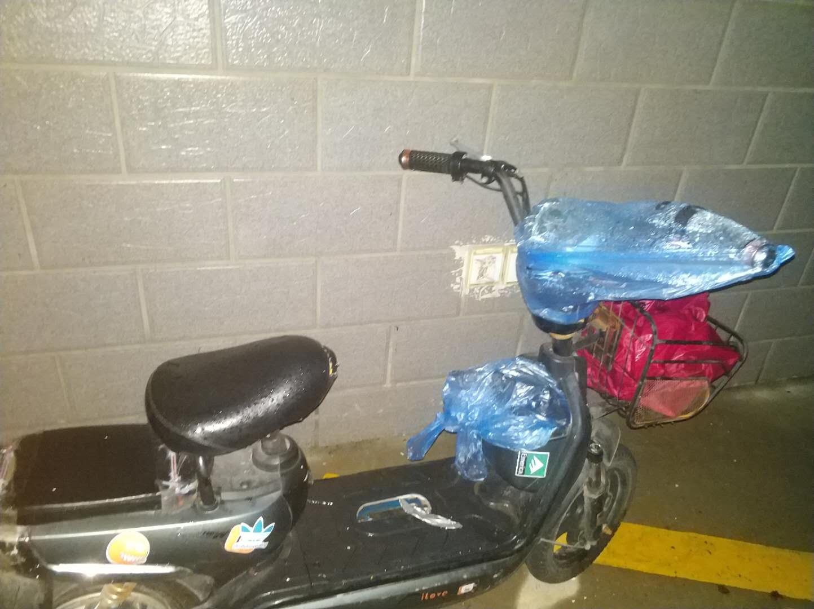

## 2020/6/15 20:24 

💰-55500    🌜  00:00    🌞 07:30   🏋 64.05kg  

#### goals
- 跳绳 3000下 +3000G

#### consume

- 晚睡 80min -8000G
- 晚起 90min -9000G

💸 结余 -55500-8000-9000+3000 = -69500G

工作快两年了

换过四次房子

最开始我是什么东西能放就会放在我的小电驴上

充电器被偷掉三四个了

在冬天零下的早晨发现车兜里的手套被偷

最近跳绳，绳子也就放车兜里，也被偷

我真的气到每次在心理嘀咕了好多骂人的话，想找个能做这种打字贴的，贴在那里

无奈每次淘宝去搜都不知道该搜什么字能搜到

这几天每天下暴雨

车子就放在室外充电

一个周日我也没出去

然后，然后就遇到了暖心的事情

真的是第一次呀！

居然有人帮我把充电器和车头都包起来！

我真的好想买个大字贴

啥都不写

就两字，大红色的，谢谢！没错现在就去淘宝搜！

*“斯库特，大多数人都是善良的，等你最终了解他们之后就会发现   ——杀死一只知更鸟”*

------

## 2020/6/16 20:04  

💰 -69500    🌜  22:30    🌞 06:00   🏋 63.25kg    

#### goals

#### consume

- 游戏 120min  -12000G

  

💸 结余 -69500-12000 = -81500G

------

## 2020/6/17 21:04  

💰 -81500    🌜  22:30    🌞 06:00   🏋 63.25kg    

#### goals

#### consume

- 游戏 180min  -18000G

  

💸 结余 -81500-18000 = -99500G

------

## 2020/6/18 21:04  

💰 -99500    🌜  22:30    🌞 06:00   🏋 63.25kg    

#### goals

#### consume

- 游戏 180min  -18000G

  

💸 结余 -99500-18000 = -117500G

------

## 2020/6/19 20:55  

💰 -117500    🌜  22:40    🌞 07:00   🏋 63.05kg    

#### goals

- 跳绳 3000下 +3000G
- 赠人玫瑰：给爸爸的父亲节礼物，斯凯奇健步鞋 319rmb +18000G

#### consume

- 晚起 60min -6000G

💸 结余 -117500+3000+18000-6000 = -102500G

翻起了余华的《活着》

昨儿一下子看了一半

这书呀，太狠了！

只要翻起来，再合上

那就是一把鼻涕一把泪去找手纸的时候

------

